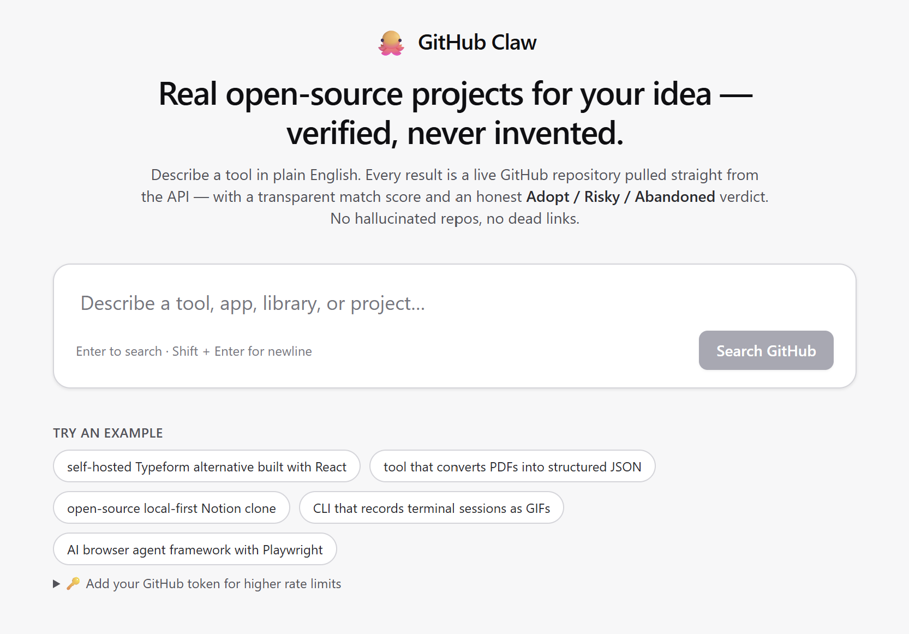

# GitHub Claw 🐙

> Real open-source projects for your idea: verified, scored, and triaged. Never invented.

[](https://github.com/simoneprezioso/GitHub-Claw/stargazers)
[](https://github.com/simoneprezioso/GitHub-Claw/commits)
[](LICENSE)


Ask an LLM "find me an open-source Typeform alternative in React" and it will happily invent a repo, link a dead URL, or quote a star count from two years ago. **GitHub Claw won't.** You describe a tool in plain English; it expands your idea into targeted GitHub searches, ranks the *real, currently-live* repositories it finds, and tells you straight up whether each one is safe to **Adopt**, **Risky**, or **Abandoned**. Every signal is pulled from the GitHub API at request time, nothing fabricated.

It's a search engine, not a chatbot. No accounts, no billing, no LLM API.

<!-- Replace with a real screenshot or GIF of the running UI; save it to docs/demo.png -->


---

## Why it's different

The thing a hallucination-prone assistant *structurally cannot promise* is the thing Claw is built around:

- **Every result is real.** Repos come straight from the GitHub REST API. If it's in the list, it exists right now, with its true star count, license, and last-push date.
- **Maintenance verdict, front and center.** Each result carries an **Adopt / Risky / Abandoned** badge derived only from fetched metadata (archive flag, push recency, license, fork status). No incumbent fuses *discovery* with a *health verdict*. This is the headline.
- **Transparent scoring.** Click any score pill to see the exact breakdown (relevance, popularity, freshness, health, penalties, optional README + semantic contributions). Nothing is a black box.
- **Grounded explanations.** The "why matched" line cites only terms that actually appear in the fetched name/description/topics/README, never invented features.

---

## In action

You type a plain-English idea, like:

```
CLI that records terminal sessions as GIFs
```

Claw fans it out into parallel GitHub searches. Notice it injected `asciinema` on its own, you never typed it:

```
cli records terminal sessions gifs in:name,description,readme stars:>5
"terminal recording" OR asciinema OR "tty recorder" OR "terminal gif" OR "shell recording" in:name,description stars:>5
topic:terminal cli records stars:>5
```

…then dedupes ~190 candidates, scores the whole pool, fetches the top READMEs, reranks, and hands back:

| # | Score | Repo | Stars | Verdict |
|---|---|---|---|---|
| 1 | **61** | [asciinema/asciinema](https://github.com/asciinema/asciinema) | 17.4k ★ | Adopt |
| 2 | **55** | [icholy/ttygif](https://github.com/icholy/ttygif) | 4.0k ★ | Adopt |
| 3 | **50** | [asciinema/asciinema-player](https://github.com/asciinema/asciinema-player) | 2.9k ★ | Adopt |

You never typed "asciinema"; synonym expansion and topic mapping did. (`asciinema/agg`, the GIF generator itself, lands right behind at #4.)

> <sub>Live figures from a smoke run on 2026-06-10 with the semantic reranker on. Stars and scores drift over time; the durable point is that the *names* came from your idea, not your keywords.</sub>

---

## Features

Beyond the four promises above, here's what's in the box:

- **Plain-English search:** describe a tool, app, library, or project in your own words.
- **Verdict tally:** beyond the per-repo Adopt / Risky / Abandoned badge, a summary count sits above the result list so you can triage a whole search at a glance.
- **Deterministic query expansion:** 58 hand-curated categories (forms, notion-likes, terminal recorders, kanban, mesh VPN, vector DBs, …), `"X alternative"` / `"X clone"` detection, tech-stack hints, and modifiers (*self-hosted*, *local-first*). Pure TypeScript, no LLM.
- **Hybrid ranking:** a transparent 0-100 score per repo. The **entire deduped candidate pool** is scored (we no longer pre-filter by stars, which used to delete niche exact matches before ranking).
- **Semantic reranker, on by default:** the top heuristic candidates are re-ordered by cosine similarity from a local 25 MB sentence-transformer (`Xenova/all-MiniLM-L6-v2`, run via [`@huggingface/transformers`](https://github.com/huggingface/transformers.js), transformers.js v3). No API key; the deterministic path stays the floor and is used automatically if the model can't load. Opt out with `DISABLE_EMBEDDING_RERANK=1`.
- **Instant filters & sort:** language picker, sort, and archived/fork/tutorial toggles are applied **client-side** over the fetched set, so they're instant and cost **zero** extra GitHub calls.
- **Bring-your-own token:** paste your own GitHub token in the UI (stored only in your browser, sent per-request via header) to lift your rate limit without the operator sharing one PAT.
- **Abuse-resistant API:** per-IP rate limiting, a global outbound-concurrency cap, and in-flight request coalescing protect the shared token from a thundering herd.
- **README-grounded explanations** for the top hits, **shareable `/?q=…` URLs**, a JSON-file **cache** (1 h searches, 24 h READMEs, with size caps and async flush), and **health badges & warnings**.
- **Multiple surfaces:** the web app, a **CLI**, and an **MCP server** all share one search pipeline (`lib/searchPipeline.ts`), so coding agents get the same grounded, verified results.
- **Tested:** unit + integration tests across query expansion, ranking, the maintenance verdict, the GitHub client, README handling, and the API route (`npm test`).

---

## Setup

### Prerequisites

- **Node.js 18.17+** (Node 20+ recommended).
- A GitHub personal access token is **optional but strongly recommended** (raises the limit from 60 → 5,000 req/hour). No scopes needed for public search.

### Install and run

```bash
npm install                        # if you hit peer-dep errors, re-run with --legacy-peer-deps
cp .env.example .env.local         # then paste your token after GITHUB_TOKEN=
npm run dev                        # → http://localhost:3000
```

### Other scripts

```bash
npm test            # vitest run
npm run test:watch  # watch mode
npm run test:cov    # coverage report
npm run typecheck   # tsc --noEmit
npm run lint        # eslint .
npm run build       # production build
npm run start       # serve the production build
npm run cli -- "self-hosted Typeform alternative in React"   # terminal search
npm run mcp          # start the MCP server (stdio) for coding agents
```

### Environment variables

| Variable | Required | Description |
|---|---|---|
| `GITHUB_TOKEN` | No | Server-side GitHub PAT. Without it, unauthenticated requests are limited to 60/hour per IP. Users can also supply their own token in the UI. |
| `DISABLE_EMBEDDING_RERANK` | No | Set to `"1"` to turn the semantic reranker **off** (it's on by default). `ENABLE_EMBEDDING_RERANK=0` also works. |
| `TRANSFORMERS_MODEL_PATH` | No | Directory containing a bundled copy of the embedding model. Set it to skip the ~25 MB download on cold start (recommended for serverless/Docker). |
| `TRUSTED_PROXY_HOPS` | No | Number of trusted reverse proxies in front of the app (default `1`). Decides which `X-Forwarded-For` entry the per-IP rate limiter treats as the client. Match it to your deployment: set `0` for a directly-exposed origin (forwarded headers become untrusted); a value that's too high lets a client spoof its IP and bypass the limit. |
| `RATE_LIMIT_SINGLE_INSTANCE_ACK` | No | Set to `"1"` to silence the one-time production warning that the rate limiter is in-process (and therefore per-instance). Set it on a single long-lived instance, or once a shared store backs the limiter. |

---

## Surfaces

### CLI

```bash
npm run cli -- "tool that converts PDFs into structured JSON"
npm run cli -- --json "kanban board self-hosted"     # machine-readable
npm run cli -- --no-rerank "rust game engine"        # skip the semantic step
GITHUB_TOKEN=ghp_… npm run cli -- "mesh vpn"          # authenticated
```

### MCP server

`npm run mcp` starts a stdio [Model Context Protocol](https://modelcontextprotocol.io) server exposing a single `search_repositories` tool. Point a coding agent / IDE at it to get **grounded, hallucination-free** repo discovery; the agent receives real repos with scores and maintenance verdicts instead of guessing. Example client config:

```jsonc
{
  "mcpServers": {
    "github-claw": {
      "command": "npm",
      "args": ["run", "--silent", "mcp"],
      "cwd": "/path/to/GitClaw",
      "env": { "GITHUB_TOKEN": "ghp_…" }
    }
  }
}
```

---

## Architecture

```
app/page.tsx ─ Suspense ─ app/HomeClient.tsx ─ SearchBox / FiltersBar / ResultsList → RepoCard
                                   │ POST /api/search { query }   (x-github-token header)
                                   ▼
app/api/search/route.ts ── rate-limit → cache → coalesce ──▶ lib/searchPipeline.ts
                                                                  │
        ┌──────────────┬──────────────┬──────────┬───────────────┤
        ▼              ▼              ▼          ▼               ▼
   queryExpansion   github        ranking    readme         embeddings
        (.ts)        (.ts)         (.ts)       (.ts)            (.ts)
                       │ withOutboundSlot (lib/limits.ts)        │
                       ▼                                          ▼
                  GitHub REST API                          local MiniLM model

CLI (scripts/claw-cli.mts) ─┐
MCP (scripts/claw-mcp.mts) ─┴─▶ lib/searchPipeline.ts   (same logic as the route)
```

`POST /api/search` accepts `{ query }`. Filters/sort are applied **client-side**, so the response is filter-independent and cached by query alone. Errors return `{ error, hint?, rateLimitRemaining? }` with the right status (400 bad input, 429 rate-limited, 502/504 upstream).

---

## How ranking works

Each repo's score is four positive components minus a penalty, clamped to 0-100. The breakdown is returned to the UI.

| Component | Range | Rewards |
|---|---|---|
| **Text relevance** | 0-50 | Weighted token overlap with name (×6), topics (×4), description (×2), language (×1.5), plus a small multi-word-phrase bonus. Original query tokens count 1.5× synonyms. |
| **Popularity** | 0-25 | `log10(stars + 1) × 5`, capped; log scale so megaprojects don't crowd out niche-but-fitting tools. |
| **Freshness** | 0-15 | ≤3 mo = 15, ≤6 mo = 12, ≤12 mo = 8, ≤18 mo = 4, else 0. |
| **Health** | 0-12 | license, ≥2 topics, homepage, real description, ≥100 stars, not archived. |
| **Penalty** | subtractive | archived -15, fork -10, awesome-list -20, tutorial/demo -8, no description -5, no license -2, no pushes in 2y+ -8. |

Two correctness notes from the latest revision:

- **The full deduped pool is ranked:** candidate selection no longer pre-sorts by stars and truncates, which previously evicted low-star exact matches before scoring.
- **Ties break on real quality, not stars:** sorting uses the fractional, unclamped `rawScore` (then text relevance, then stars), so a tangential megaproject can't win a tie over an exact match, and two penalty-floored repos still order by their true relative quality.

### Maintenance verdict

Derived purely from fetched metadata:

- **Abandoned:** archived, or no commits in 2+ years.
- **Risky:** no commits in 1+ year, a fork, no license, or it looks like a curated list / tutorial.
- **Adopt:** recent activity, licensed, no red flags.

### Tutorial / awesome detection

Re-scoped to avoid false positives: we no longer match a bare `awesome` (it nuked real libraries) or a bare `learning` (it flagged every ML repo). "Awesome list" now requires an actual list signal or the `awesome-` name prefix; weak signals (demo/example/starter/boilerplate) are matched in the **name/topics only**, never the description.

---

## License

MIT: do what you want, attribution appreciated
